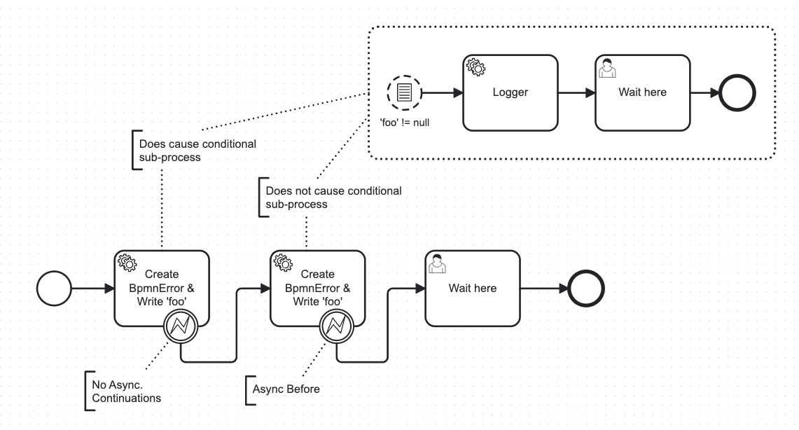
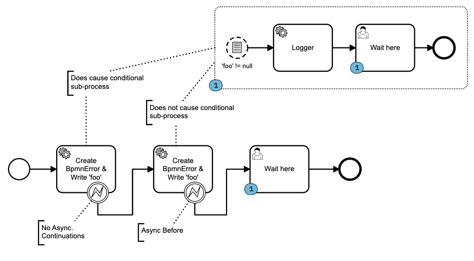

# camunda-platform-7-example-conditional-event-not-triggered

This repository contains a Camunda Platform 7 (v7.19.0) demo-process-application 
that illustrates a non-interrupting conditional start-event, 
that is not triggered by an external-task throwing a bpmn-error, 
only if the regarding error-boundary-event is marked as asynchronous before.  
  
The process-application starts one process-instance of this demo process after startup.

  

The generated log is:
```
de.rnschk.workflow.log : execute task, foo=8bef3f30
de.rnschk.workflow.log : execute logger, foo=8bef3f30
de.rnschk.workflow.log : execute task, foo=8bf7558a
```
  
The Camunda Cockpit looks like:

